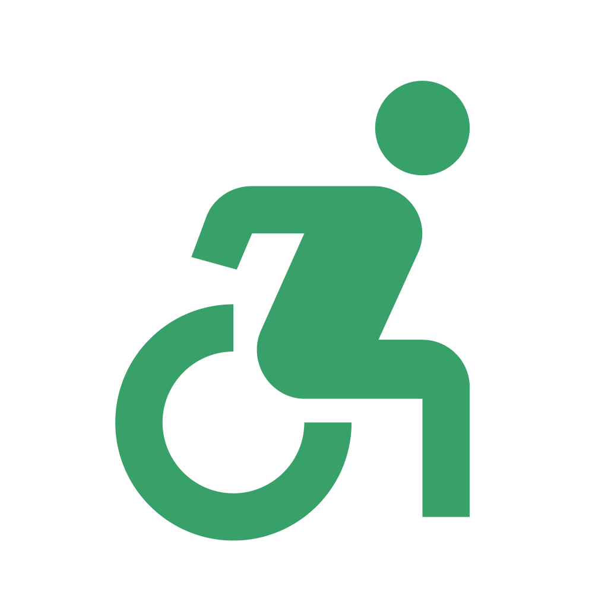
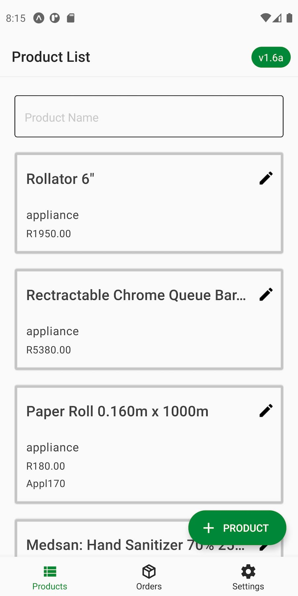
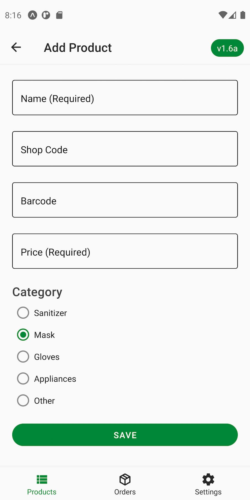
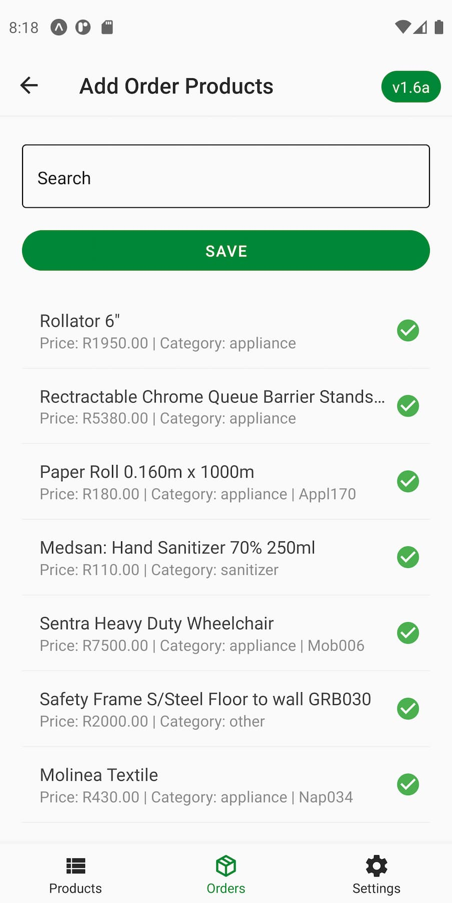
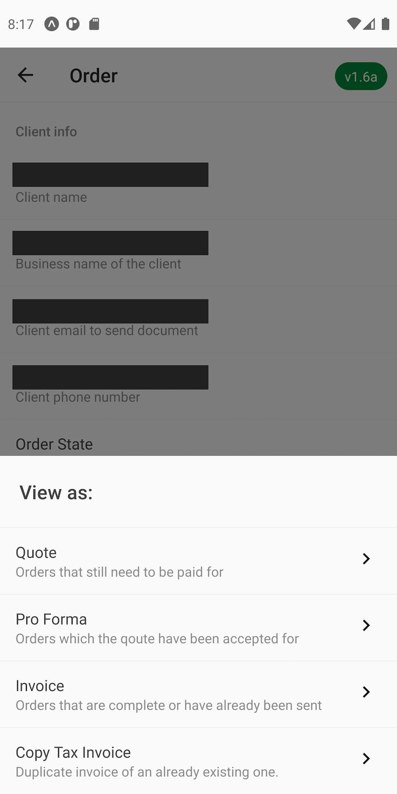

# Mobility Crunch mobile app

Starting the year 2020, when the pandemic had gone full swing in South Africa, Gerimed Mobility saw a massive influx in demand for their medical supplies. To ease the load on the owner and employees, I designed and built a mobile app to handle transactional documents right from their pocket.

## Screenshots

 

 

 

## Tech Stack

**Client:**

**Server:**

